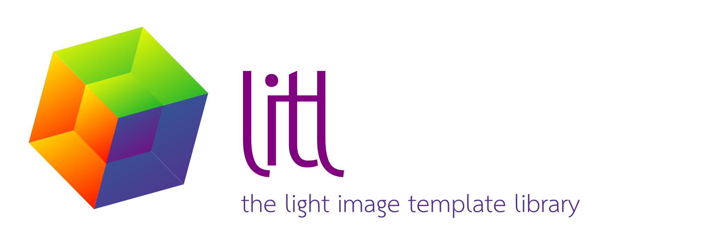

# Project Overview

# Purpose

This project is a work in progress to gather ND array related features
of [EleFits](https://cnes.github.io/EleFits/)' Raster -- an extensible ND data storage class with pixel-wise operations --
and PhiFun's operations -- e.g. Fourier transforms, linear filtering, and interpolation.

The target is a header-only library focused on ease of use
and which interfaces seamlessly with the standard C++ library.
At some point, the ND array implementation of EleFits should be droped in favor of Litl.

The image processing feature set is expected to grow steadily on demand.
Currently supported operations are:

* Pixel-wise operations (`+`, `*`, `exp()`, `apply()`...);
* Discrete Fourier transforms (FFTW wrapper) through the `DftPlan` class;
* Linear filtering through the `Kernel` class;
* Interpolation and extrapolation (`NearestNeighbor`, `Linear`, `OutOfBoundsConstant`...);
* Affine transformations.

# License

[LGPL-3.0-or-later](LICENSE.md)

# Alternatives

The following libraries offer features similar to Litl.
Most of the libraries which support ND arrays are focused on linear algebra,
while most image processing libraries limit the number of axes.
ITK (and SimpleITK) is the notable exception.
Litl aims at being less verbose and more extensible,
although with a more limited feature set.

* Armadillo
* Blitz++
* Boost.MultiArray
* CImg
* Eigen
* ITK, SimpleITK
* ndarray
* OpenCV
* STL's valarray
* XTensor
