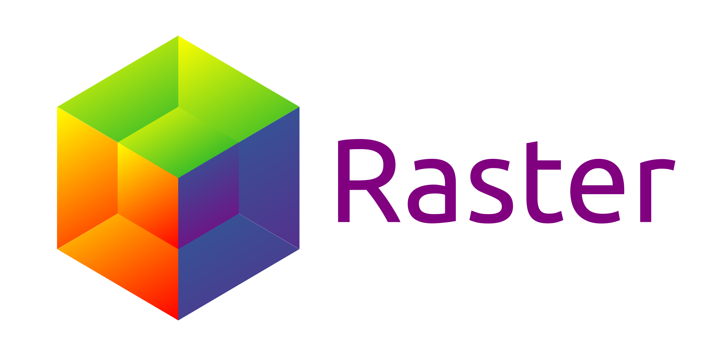

# Project overview

# Purpose

This project is a work in progress to gather ND array related features
of EleFits' Raster -- an extensible ND data storage class with pixel-wise operations --
and PhiFun's operations -- e.g. Fourier transforms, linear filtering, and interpolation.

The target is a header-only library focused on ease of use
and which interfaces seamlessly with the standard C++ library.
The image processing feature set is expected to grow steadily on demand.
Currently supported operations are:

* Pixel-wise operations (`+`, `*`, `exp()`, `apply()`...);
* Discrete Fourier transforms through the `Dft` class;
* Linear filtering through the `Kernel` class.

# License

[LGPL-3.0-or-later](LICENSE.md)

# Alternatives

* Armadillo
* Blitz++
* Boost.MultiArray
* CImg
* Eigen
* ITK, SimpleITK
* ndarray
* OpenCV
* STL's valarray
* XTensor
